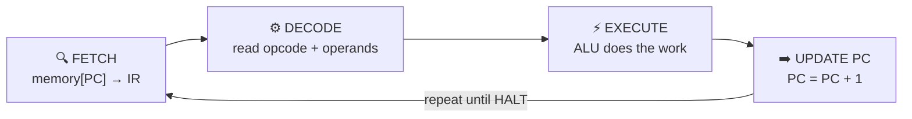

<div align="center">

# 🧠 Instruction Cycle Simulator

### Visualizing the heartbeat of a CPU


### [▶ Open the live simulator](https://sharonpeter669966-bit.github.io/Instruction-cycle-stimulator/)

</div>

---

## 📖 About

A live, interactive simulator that shows how a CPU **fetches, decodes and executes** instructions, one stage at a time. Type your own program, press **Next step** or **Run**, and watch the registers, ALU, flags and memory change.

Nothing is hardcoded. Every change you make to the program is parsed and loaded instantly.

## 🔌 CPU Architecture

<div align="center">


</div>

| Block | Role |
|---|---|
| **Memory** | Holds the program and the data |
| **IR** (Instruction Register) | Holds the instruction being worked on |
| **Control Unit** | Decodes the opcode and directs the other blocks |
| **Registers** | R0 to R3, small fast storage, plus the Z, C, S flags |
| **ALU** | Does the arithmetic and logic (ADD, SUB, AND, OR) |
| **PC** (Program Counter) | Points to the next instruction's address |

## 🔄 The Instruction Cycle



| Stage | What happens |
|---|---|
| **1. Fetch** | The instruction at address PC is copied from memory into IR |
| **2. Decode** | The Control Unit identifies the opcode and its operands |
| **3. Execute** | The ALU, registers or memory carry out the operation |
| **4. Update PC** | The PC moves on to the next instruction |

## ✨ Features

- ⌨️ Write any program, and it loads as you type
- 👣 Step through Fetch, Decode, Execute and Update PC
- 🗂️ Editable registers R0 to R3 and 16 cells of data memory
- 🧮 ALU panel showing operands, operation and result
- 🚩 Status flags: Zero (Z), Carry (C), Sign (S)
- ▶️ Run, Pause, Reset and a speed slider
- 📜 Trace log of every stage
- ❗ Clear error messages with line numbers

## 📋 Supported Instructions

| Instruction | What it does |
|---|---|
| `MOV R1, 10` | Put a number or another register into R1 |
| `LOAD R1, 3` | R1 = data memory[3] |
| `STORE R1, 3` | data memory[3] = R1 |
| `ADD R1, R2` | R1 = R1 + R2 (or a number) |
| `SUB R1, R2` | R1 = R1 - R2 (or a number) |
| `AND R1, R2` | Bitwise AND |
| `OR R1, R2` | Bitwise OR |
| `HALT` | Stop execution |

> Values are 8-bit (0 to 255) and wrap around at 256. Text after `;` is a comment.

## 🧪 Example

```asm
MOV R1, 10     ; R1 = 10
MOV R2, 5      ; R2 = 5
ADD R1, R2     ; R1 = 15
SUB R1, R2     ; R1 = 10
HALT
```

**Final result:** `R1 = 10`, `R2 = 5`, `PC = 04`

## 🚀 Run it yourself

```bash
git clone https://github.com/sharonpeter669966-bit/Instruction-cycle-stimulator.git
cd Instruction-cycle-stimulator
```

Then open `index.html` in a browser, or use the **Live Server** extension in VS Code.

## 📁 Project Structure

```
Instruction-cycle-stimulator/
├── index.html       # page structure
├── style.css        # styling
├── script.js        # CPU logic, parser, rendering
├── cpu-diagram.svg  # architecture diagram
└── README.md
```

## 🎯 Objectives

- Simulate the basic instruction execution process of a CPU
- Demonstrate the fetch-decode-execute cycle
- Visualize registers, memory and the ALU at work
- Show the role of the Program Counter and Instruction Register

## 🎓 Applications

- Helps students understand how a CPU works inside
- Useful for learning Computer Organization concepts
- Easy to extend with more instructions, such as jumps

## 🔗 Links

- 💻 [Source code](https://github.com/sharonpeter669966-bit/Instruction-cycle-stimulator)
- 🌐 [Live simulator](https://sharonpeter669966-bit.github.io/Instruction-cycle-stimulator/)

---

<div align="center">

Made with ❤️ using HTML, CSS and JavaScript

</div>
